# Set A Custom Domain On My GitHub Page & Proof Ownership

My domain is on CloudFlare: `hexterikacyberlab.com`

My website is on GitHub.

## Objective

+ Make `https://hexterikacyberlab.com/` features my github website.

***The setup takes place on both Cloudflare and GitHub. You need to setup on both. The guide below tells you one platform at the time.***

---

## The Setup On GitHub Side

***Step 1.*** On GitHub, go to the correct repo. Click on settings > Page > Add `www.hexterikacyberlab.com` and clicked `save`.

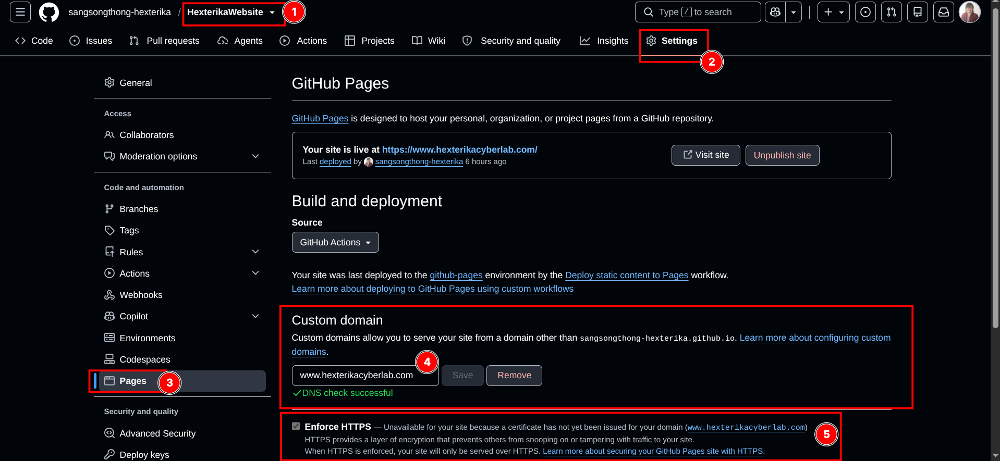

**A note on `www` vs the apex domain**

Your custom domain can be set two ways:

+ **Subdomain style:** `www.hexterikacyberlab.com`
+ **Apex style:** `hexterikacyberlab.com` (also called the bare, root, or naked domain — no `www`)

Two separate ideas here, and it's easy to mix them up:

+ **The Custom domain field (on GitHub) and the `CNAME` file (in your repo) must always hold the *same* value.** They're not two independent settings — they're one value shown in two places. Typing into GitHub's field rewrites the `CNAME` file, and editing the `CNAME` file updates the field. If they ever disagree, something is out of sync (mine did, because of leftover records from an old domain — I fixed it by making both say `www.hexterikacyberlab.com`).

+ **Whether that shared value is `www` or apex is your choice.** GitHub recommends `www`, because a `www` subdomain isn't affected if GitHub ever changes its server IP addresses, so it's the more stable option. The apex version works fine too. As long as you've set up DNS for both (the `www` CNAME record *and* the apex A records), GitHub automatically redirects one to the other — so visitors reach your site either way. I chose `www` to follow GitHub's recommendation.

***In short:*** the field and the file always match each other; picking `www` vs apex just decides which one is your site's main address and which one redirects to it.

***Step 2.*** Wait until the DNS verified it. The successful version has the green checked mark on it. If it throws an error, log into the Cloudflare dashboard to configure the DNS.

+ Note that the Cloudflare DNS has to be configured for it to work. If it has not configured, GitHub will throw an error regardless. It doesn’t mean you broke the setup. It means you setup has not been completed so you need to switch to Cloudflare dashboard to setup the DNS first in order for this to work.

A successful attempt screenshot.

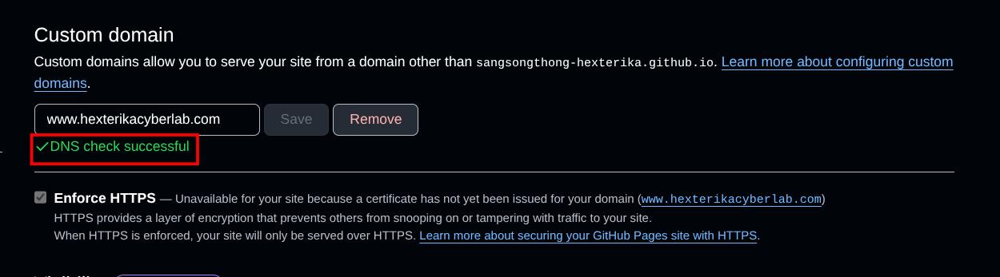

***Step 3.*** Once the DNS is verified (shown as the green check mark in the screenshot 2b, wait until GitHub gives you the SSL/TLS certificate. This can take a few minutes to 24 hours. If after 24 hours has and you still cannot tick the box to apply the SSL/TLS, this is when you need to worry and troubleshoot.

Here is the successful screenshot.

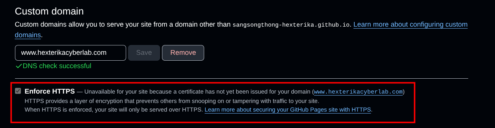

---

## The Setup On Cloudflare Side

***Step 1.*** Open my Cloudflare dashboard > click `Configure DNS`

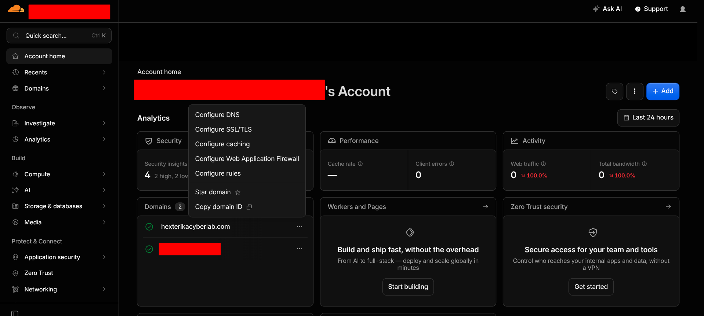

***Step 2.*** On the DNS configuration screen, click `Add record`. If this is your fresh configuration after you got the domain, it is likely going to be empty. I took the screenshots after I have done some setup so it is not empty.

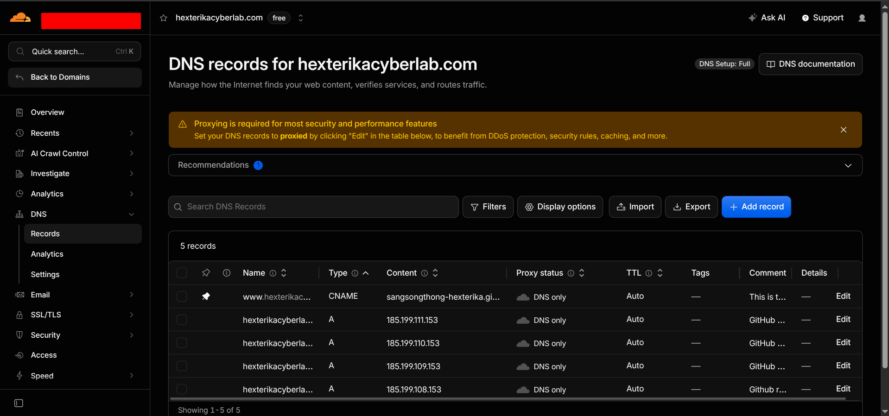

***Step 3.*** Take a look at the `Add record` detail. This is where you should pay attention to.

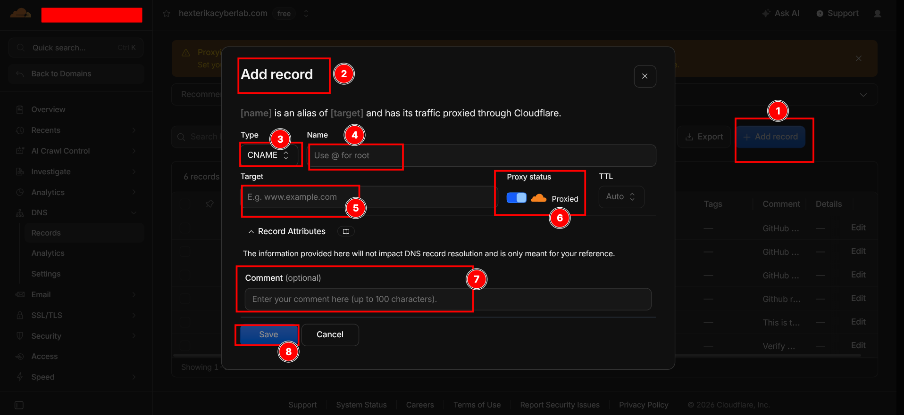

The `Type` field is where you choose `CNAME`, `A`, `TXT`, etc record.

The `Name` field, you usually type `@` here or type `hexterikacyberlab.com` if the system does not recognize the `@` . In my past experience, some provider did not recognize the `@` sign right away. However, Cloudflare saw and accepted it immediately.

The `Target` field, type your IP here one at a time or your other value.

The `Proxy Status` toggle, toggle it to the grey cloud for now. Cloudflare will show a security recommendation warning. Ignore it for now. Adding it in this step might causes some setup problem later. Finish the requirement setting first before coming back here to add proxy. In my example, I created a static website with HTML/CSS, no database, no login page, etc. My site’s attack vectors are narrow. Adding proxy will not help increasing the security much, but the proxy itself sits between the visitors and GitHub that’s why GitHub might have trouble seeing the website due to the proxy. If this happens, simply switch back to the grey cloud temporarily.

The `Comment` field is optional. I kept my own note for each record item for reference later.

Note that some fields change slightly when the `Type` value changes.

Here are the info to add. The IPv4 address I added are from GitHub.

| No. | Type | Name | Target / IPv4 Address | Proxy |
| --- | --- | --- | --- | --- |
| 1 | CNAME | www | `sangsongthong-hexterika.github.io` | DNS only (grey) |
| 2 | A | @ | `185.199.108.153` | DNS only (grey) |
| 3 | A | @ | `185.199.109.153` | DNS only (grey) |
| 4 | A | @ | `185.199.110.153` | DNS only (grey) |
| 5 | A | @ | `185.199.111.153` | DNS only (grey) |

Note that the target is your `<username>.github.io` host, **not** the specific `<username>.github.io/<repo-name>`. This confused me at first, so here's the reasoning if you have more than one repo like I do:

A DNS record can only point at a *host* (a domain name) — it has no concept of "which repo" or any path after the domain. So the `CNAME` record just delivers traffic to GitHub's front door for your whole account: `<username>.github.io`. It does **not**, and cannot, name a specific repo.

So how does GitHub know *which* of my repos to serve? That's the job of the `CNAME` file. Each GitHub Pages repo can hold a `CNAME` file naming the custom domain it claims. Mine (inside the correct repo) contains `www.hexterikacyberlab.com`. When a visitor's request arrives at GitHub for that domain, GitHub matches it to the repo whose `CNAME` file claims it, and serves that repo's site.

In short: **DNS gets the traffic to GitHub; the `CNAME` file inside the repo tells GitHub which repo to serve.** The two do different jobs — that's why you point DNS at the host, not the repo.

***Step 4.*** Verify the setting with `dig` on your terminal on your computer.

***Command 1:*** `dig www.hexterikacyberlab.com +noall +answer`

***Command 2:*** `dig hexterikacyberlab.com +noall +answer -t A`

The screenshot below shows the verification succession.

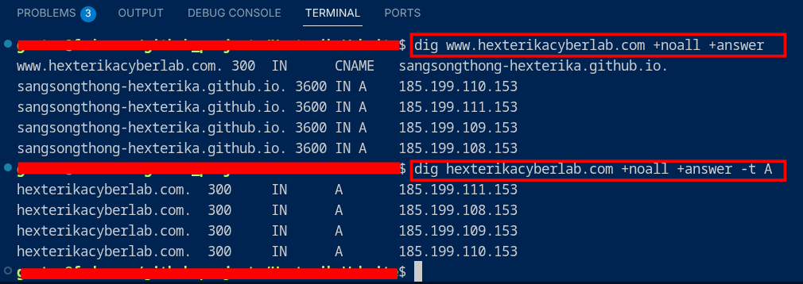

---

### **Now you are done with all the requirement setup.**

Adding Cloudflare proxies is optional and will not help much with your static website. It will only helps with cache download and can cause problems when GitHub re-issue the SSL/TLS which is something to watch out for.

You can configure it. If problems happen, just temporarily flip the proxy button back from orange to grey until it works again and then make it works.

### The How To

1. Cloudflare → **SSL/TLS → set encryption mode to "Full"** *first*. (Skip this and you get infinite redirect loops.)
2. Then flip the records to orange: the `www` CNAME and the four `@` A records.
3. Immediately test `https://www.hexterikacyberlab.com` — check it loads, padlock is valid, no redirect loop.
4. Over the next couple of weeks, glance at GitHub Pages to confirm the **certificate still renews** — the known downside of proxying is that Cloudflare in front can occasionally block GitHub from re-verifying and renewing its cert. If that ever happens, flip back to grey temporarily.

---

## Now This is a high stakes move. Domain Verification

## Domain Verification

Note that this is NOT the same as the setup above. The setup above is the DNS verification.

+ **"DNS check successful"** (what you saw) = GitHub confirmed your DNS *points at* Pages. It's about routing. ✅ done. —> This is what you did above.
  
+ **Domain verification** = you *prove ownership* of `hexterikacyberlab.com` to your GitHub account, so no other GitHub account can ever attach your domain to their repo. It's about *ownership lock*, and it's a separate flow with its own `TXT` record. —> This is what you are going to do here.

## How Verify Your Domain To GitHub (Proof Domain Ownership)

***Step 1.*** GitHub → click your profile (top right) → **Settings** (your *account* settings, not the repo).

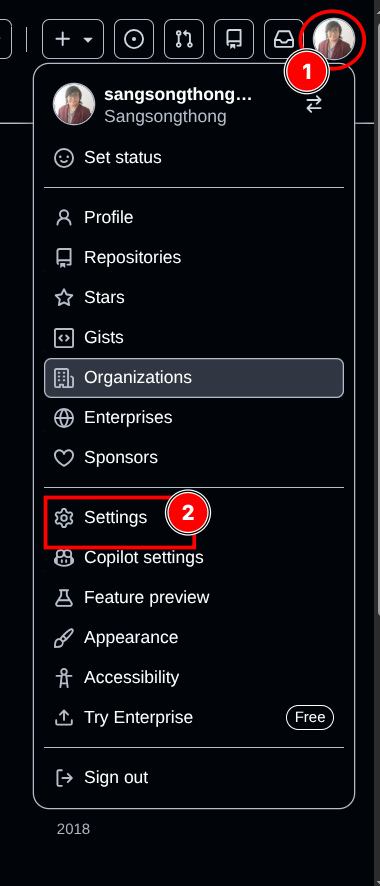

***Step 2.*** Left sidebar → **Pages**.

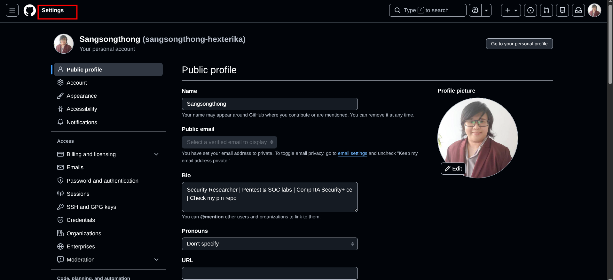

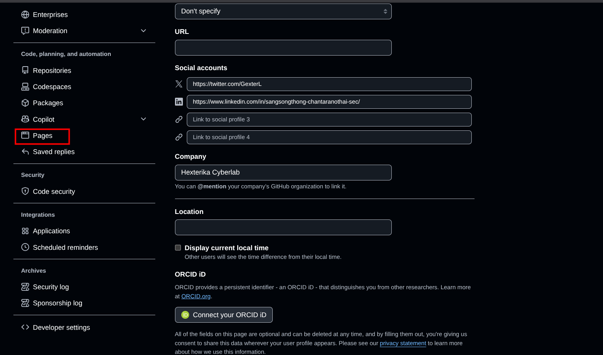

***Step 3.*** **Add a domain** → type `hexterikacyberlab.com` → **Add domain**.

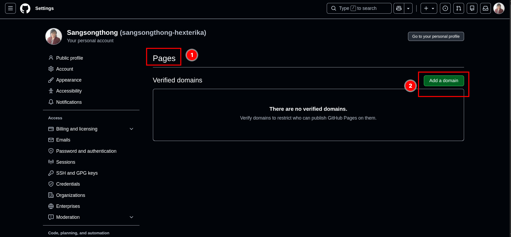

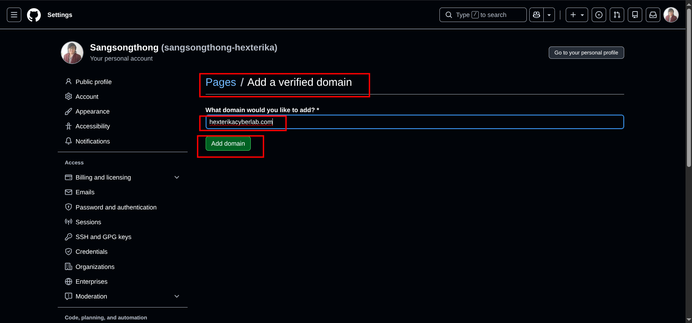

***Step 4.*** GitHub shows you a TXT record — a name like `_github-pages-challenge-sangsongthong-hexterika.hexterikacyberlab.com` and a code value.

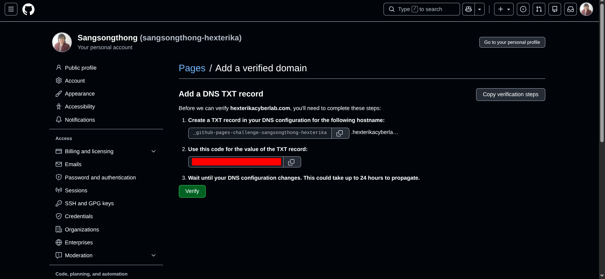

***Step 5.*** In Cloudflare → DNS → **Add record**: Type `TXT`, Name = the `_github-pages-challenge-...` part GitHub gives you, Content = the code. Proxy status is irrelevant for TXT (there's no cloud toggle on TXT records).

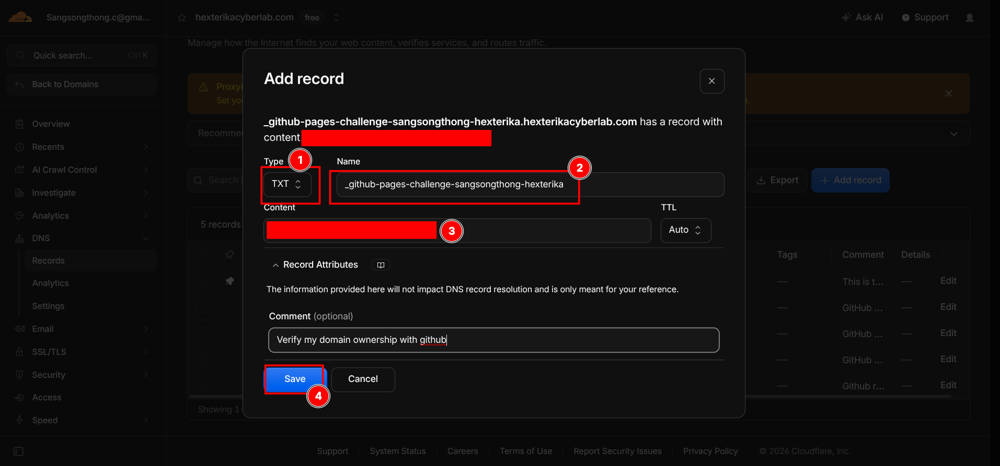

***Step 6.*** Verify on my terminal

***Command:*** `dig _github-pages-challenge-sangsongthong-hexterika.hexterikacyberlab.com +noall +answer -t TXT`

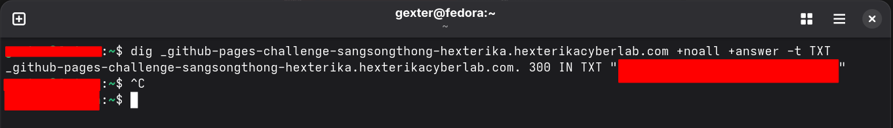

***Step 7.*** Back on GitHub (step 4) → Click **Verify**. Once it passes, your domain is locked to your account.

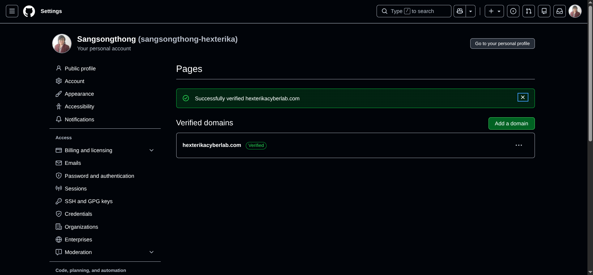

---
